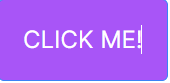
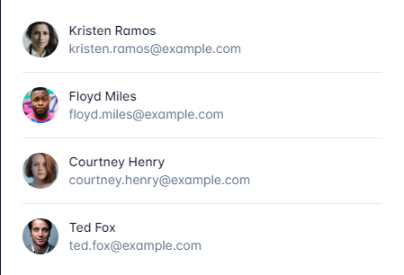
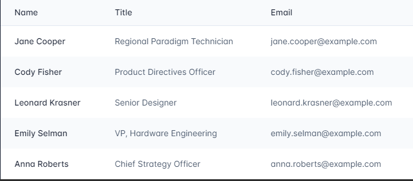
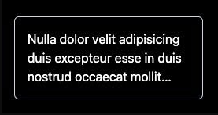

# Tailwind Tricks You NEED To Know!

## Introduction

Today i am gona show some tips that I really wish I knew earlier and it doesn't matter if you're a beginner or an advanced Tailwind user there should be something on the list that will improve your development experience so let's get straight into it

### Using Tailwind inside CSS

There are some times where we are forced to use CSS for our styles; for example, when using a third-party library. We can stick with the Tailwind colors by using the @apply directive or the theme function. Let’s have a look at a code example:

```css
.__some-external-class {
  /* Using @apply we can use any utility class name from Tailwind */
  @apply text-blue-300 bg-gray-300 py-2 px-6 rounded-lg uppercase;

  /* or using the theme() function */
  color: theme("colors.blue.300");
  background-color: theme("colors.gray.300");
  padding: theme("padding.2") theme("padding.6");
  border-radius: theme("borderRadius.lg");
  text-transform: uppercase;
}
```

### Group and peer utility classes

Tailwind allows us to change the style of an element based on its state with helper classes such as :hover, :checked, :disabled, :focus, and more (you can find [them all here](https://tailwindcss.com/docs/hover-focus-and-other-states#quick-reference)). So it’s easy for us to do something like this:

```html
<button
  class="bg-purple-500 border border-blue-500 text-white text-2xl uppercase p-6 rounded-md m-4 transition-colors hover:bg-purple-800 hover:border-blue-200 hover:text-gray-200"
>
  Click me!
</button>
```

The result would be the below:



What if we want to change the style based on the state of another element? This is where the `peer` and the `group` utility classes come in handy.

#### Style based on parent state

For instance, we can change the style of child elements when the parent is hovered by turning the parent into a group and using `group` and `group-hover:` utility classes:

```html
<div class="relative rounded-xl overflow-auto p-8">
  <a
    href="#"
    class="group block max-w-xs mx-auto rounded-lg p-4 bg-white ring-1 ring-slate-900/5 shadow-lg space-y-3 
     hover:bg-sky-500 
     hover:ring-sky-500"
  >
    <div class="flex items-center space-x-3">
      <h3 class="text-sm text-slate-900 font-semibold group-hover:text-white">
        New project
      </h3>
    </div>
    <p class="text-sm text-slate-500 group-hover:text-white">
      Create a new project from a variety of starting templates.
    </p>
  </a>
</div>
```


There are more helper classes to modify the child elements and this works for almost every pseudo-class modifier (here’s [the full list](https://tailwindcss.com/docs/hover-focus-and-other-states#pseudo-class-reference)).

#### Style based on sibling state

The peer class modifier can be used to style an element based on the state of it’s sibling. You can use the peer-{modifier} where {modifier} can be any pseudo-class modifier.

Here’s a simple example:

```html
<div class="flex flex-col items-center gap-20 p-10 bg-pink-400">
  <p class="peer cursor-pointer">I am sibling 1</p>
  <p class="peer-hover:text-white">I am sibling 2</p>
</div>
```


#### You can name names

Both with the `group` and `peer` you can give unique names to differentiate groups and peers.

This is done by adding `/{name}` to either helper classes, for example:

```html
<div class="group/main w-[30vw] bg-purple-300">
  <div
    class="group/hello peer/second h-20 w-full flex flex-col items-center justify-around"
  >
    <p class="group-hover/hello:text-white">Hello Wolrd!</p>
    <p>All this code belogs to us</p>
  </div>
  <div
    class="peer-hover/second:bg-red-400 w-[200px] h-[200px] bg-blue-300"
  ></div>
  <div
    class="group-hover/main:bg-green-200  w-[200px] h-[200px] bg-orange-300"
  ></div>
</div>
```


### First, last, odd, and even

Style an element when it is the first-child or last-child using the first and last modifiers:

```html
<ul role="list" class="p-6 divide-y divide-slate-200">
  {#each people as person}
  <!-- Remove top/bottom padding when first/last child -->
  <li class="flex py-4 first:pt-0 last:pb-0">
    
    <div class="ml-3 overflow-hidden">
      <p class="text-sm font-medium text-slate-900">{person.name}</p>
      <p class="text-sm text-slate-500 truncate">{person.email}</p>
    </div>
  </li>
  {/each}
</ul>
```



You can also style an element when it’s an odd or even child using the odd and even modifiers

```html
<table>
  <!-- ... -->
  <tbody>
    {#each people as person}
    <!-- Use a white background for odd rows, and slate-50 for even rows -->
    <tr class="odd:bg-white even:bg-slate-50">
      <td>{person.name}</td>
      <td>{person.title}</td>
      <td>{person.email}</td>
    </tr>
    {/each}
  </tbody>
</table>
```



### Truncate your text easily

Another nifty utility class is `line-clamp`, which allows you to truncate multiline text by simply adding a number such as `line-clamp-3`:

```html
<article
  class="mt-20 border border-slate-300 rounded-md p-4 ml-6 text-white w-60"
>
  <p class="line-clamp-3">
    Nulla dolor velit adipisicing duis excepteur esse in duis nostrud occaecat
    mollit incididunt deserunt sunt. Ut ut sunt laborum ex occaecat eu tempor
    labore enim adipisicing minim ad. Est in quis eu dolore occaecat excepteur
    fugiat dolore nisi aliqua fugiat enim ut cillum. Labore enim duis nostrud
    eu. Est ut eiusmod consequat irure quis deserunt ex. Enim laboris dolor
    magna pariatur. Dolor et ad sint voluptate sunt elit mollit officia ad enim
    sit consectetur enim.
  </p>
</article>
```

The rendered result will put an ellipsis after 3 lines of text:



### Editor extensions

The [Tailwind CSS](https://marketplace.visualstudio.com/items?itemName=bradlc.vscode-tailwindcss) Intellisense extension for your IDE is one of the main reasons why Tailwind is so pleasant to use. It auto-completes the class names for you, shows you the color being used, and explains the details of the class when you hover over it.


### Using tailwind-merge

A common use case when building components is having some sort of base or default style that can be overridden, by passing a class or a prop.

The tailwind-merge package is very useful to deal with this. It allows us to pass the base classes as the first parameter and the class name as the second parameter, ensuring that our class name overrides the default class (for a deeper dive as to how this works, see [this video](https://www.youtube.com/watch?v=tfgLd5ZSNPc)).

Here’s an example:

```tsx
import { twMerge } from "tailwind-merge";

const SpecialButton: React.FC<{ className?: string }> = ({ className }) => {
  return (
    <button
      className={twMerge("px-2 py-1 bg-red-500 hover:bg-red-800", className)}
    >
      Click me!
    </button>
  );
};
// Then we can override the style like so:
// some-other-component.js

const Component = () => {
  <div>
    <h1>Hello!</h1>
    <SpecialButton className="bg-blue-500 hover:bg-blue-800" />
  </div>;
};
```

### Conclusion

And that's it! These are just some of the many tips and tricks available to you when using Tailwind CSS. With its wide range of utility classes and responsive design capabilities, the possibilities are endless. So get creative, have fun, and don't be afraid to experiment with new styles and designs. With Tailwind CSS, you can create beautiful and functional websites with ease 🚀

### Link Reference

[Dev.to](https://dev.to/builderio/tailwind-css-tips-and-tricks-worth-knowing-1j00)

[Tailwinds](https://tailwindcss.com/)
